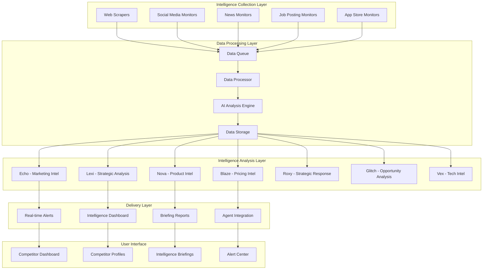

# Competitor Stalker - Real Business Intelligence Design

## Overview

The Competitor Stalker system transforms SoloSuccess AI into a comprehensive competitive intelligence platform that monitors competitors across multiple channels, analyzes data using specialized AI agents, and delivers actionable insights through an engaging spy thriller interface. The system leverages web scraping, social media APIs, AI analysis, and real-time notifications to provide solo founders with enterprise-level competitive intelligence capabilities.

The architecture follows a modular design with distinct intelligence gathering, analysis, and delivery components, all integrated seamlessly with the existing SoloSuccess AI agent ecosystem. The system prioritizes real-time data collection, intelligent analysis, and ethical data practices while maintaining the platform's punk rock aesthetic and user experience.

## Architecture

### High-Level System Architecture



### Data Flow Architecture

1. **Collection Phase**: Multiple specialized monitors continuously gather data from various sources
2. **Processing Phase**: Raw data is cleaned, normalized, and queued for analysis
3. **Analysis Phase**: AI agents analyze data according to their specializations
4. **Intelligence Phase**: Processed insights are stored and categorized by importance and urgency
5. **Delivery Phase**: Intelligence is delivered through appropriate channels based on user preferences and urgency

## Components and Interfaces

### Intelligence Collection Components

#### Web Scraper Service

```typescript
interface WebScraperService {
  scrapeCompetitorWebsite(competitorId: string): Promise<WebsiteData>
  detectWebsiteChanges(competitorId: string): Promise<ChangeDetection[]>
  monitorPricingPages(competitorId: string): Promise<PricingData>
  trackProductPages(competitorId: string): Promise<ProductData>
  scheduleRegularScraping(competitorId: string, frequency: ScrapingFrequency): void
}

interface WebsiteData {
  competitorId: string
  url: string
  content: string
  metadata: WebsiteMetadata
  scrapedAt: Date
  changes: ChangeDetection[]
}
```

#### Social Media Monitor

```typescript
interface SocialMediaMonitor {
  monitorLinkedInActivity(competitorId: string): Promise<LinkedInData[]>
  trackTwitterMentions(competitorId: string): Promise<TwitterData[]>
  analyzeFacebookPosts(competitorId: string): Promise<FacebookData[]>
  monitorInstagramContent(competitorId: string): Promise<InstagramData[]>
  detectEngagementPatterns(competitorId: string): Promise<EngagementAnalysis>
}

interface SocialMediaData {
  platform: 'linkedin' | 'twitter' | 'facebook' | 'instagram'
  competitorId: string
  postId: string
  content: string
  engagement: EngagementMetrics
  publishedAt: Date
  sentiment: SentimentScore
}
```

#### News and Media Monitor

```typescript
interface NewsMonitor {
  trackCompetitorMentions(competitorId: string): Promise<NewsArticle[]>
  monitorPressReleases(competitorId: string): Promise<PressRelease[]>
  analyzeSentiment(articles: NewsArticle[]): Promise<SentimentAnalysis>
  detectTrendingTopics(competitorId: string): Promise<TrendingTopic[]>
}

interface NewsArticle {
  title: string
  content: string
  source: string
  publishedAt: Date
  sentiment: SentimentScore
  competitorMentions: CompetitorMention[]
  keyTopics: string[]
}
```

#### Job Posting Monitor

```typescript
interface JobMonitor {
  trackJobPostings(competitorId: string): Promise<JobPosting[]>
  analyzeHiringPatterns(competitorId: string): Promise<HiringAnalysis>
  detectStrategicHires(competitorId: string): Promise<StrategicHire[]>
  monitorTeamGrowth(competitorId: string): Promise<TeamGrowthMetrics>
}

interface JobPosting {
  competitorId: string
  title: string
  department: string
  location: string
  requirements: string[]
  postedAt: Date
  strategicImportance: 'low' | 'medium' | 'high' | 'critical'
}
```

### AI Analysis Components

#### Intelligence Analysis Engine

```typescript
interface IntelligenceAnalyzer {
  analyzeMarketingStrategy(data: SocialMediaData[]): Promise<MarketingIntelligence>
  assessCompetitiveThreat(competitor: Competitor): Promise<ThreatAssessment>
  identifyOpportunities(competitorData: CompetitorData): Promise<Opportunity[]>
  generateStrategicInsights(analysis: AnalysisData): Promise<StrategicInsight[]>
  predictCompetitorMoves(historicalData: CompetitorData[]): Promise<Prediction[]>
}

interface MarketingIntelligence {
  messagingThemes: string[]
  targetAudience: AudienceAnalysis
  contentStrategy: ContentStrategyAnalysis
  campaignEffectiveness: EffectivenessMetrics
  recommendedCounterStrategies: Strategy[]
}

interface ThreatAssessment {
  threatLevel: 'low' | 'medium' | 'high' | 'critical'
  competitiveAdvantages: string[]
  vulnerabilities: string[]
  marketOverlap: number
  recommendedActions: Action[]
}
```

#### Agent-Specific Analysis Interfaces

```typescript
interface EchoMarketingAnalysis {
  analyzeContentStrategy(posts: SocialMediaData[]): Promise<ContentAnalysis>
  assessBrandPositioning(competitorData: CompetitorData): Promise<BrandAnalysis>
  identifyMessagingGaps(competitors: Competitor[]): Promise<MessagingOpportunity[]>
  generateCounterCampaigns(competitorCampaigns: Campaign[]): Promise<CounterStrategy[]>
}

interface LexiStrategicAnalysis {
  performCompetitivePositioning(competitors: Competitor[]): Promise<PositioningMap>
  analyzeMarketTrends(industryData: IndustryData): Promise<TrendAnalysis>
  assessStrategicMoves(competitorActions: Action[]): Promise<StrategicAssessment>
  generateCompetitiveResponse(threats: Threat[]): Promise<ResponseStrategy>
}

interface NovaProductAnalysis {
  analyzeProductFeatures(productData: ProductData[]): Promise<FeatureAnalysis>
  assessUXTrends(designData: DesignData[]): Promise<UXTrendAnalysis>
  identifyProductGaps(competitorProducts: Product[]): Promise<ProductOpportunity[]>
  generateProductRecommendations(analysis: ProductAnalysis): Promise<ProductRecommendation[]>
}
```

### Data Storage Components

#### Competitor Intelligence Database Schema

```typescript
interface CompetitorProfile {
  id: string
  name: string
  domain: string
  industry: string
  size: CompanySize
  fundingStage: FundingStage
  threatLevel: ThreatLevel
  monitoringConfig: MonitoringConfig
  createdAt: Date
  updatedAt: Date
}

interface IntelligenceData {
  id: string
  competitorId: string
  dataType: 'website' | 'social' | 'news' | 'jobs' | 'product'
  rawData: any
  processedData: any
  analysisResults: AnalysisResult[]
  importance: 'low' | 'medium' | 'high' | 'critical'
  collectedAt: Date
  analyzedAt: Date
}

interface CompetitorAlert {
  id: string
  competitorId: string
  alertType: AlertType
  title: string
  description: string
  importance: AlertImportance
  actionRequired: boolean
  recommendedActions: Action[]
  createdAt: Date
  acknowledgedAt?: Date
}
```

### User Interface Components

#### Intelligence Dashboard Interface

```typescript
interface IntelligenceDashboard {
  renderCompetitorOverview(): React.Component
  displayThreatMatrix(): React.Component
  showRecentAlerts(): React.Component
  renderMarketPositioning(): React.Component
  displayIntelligenceFeed(): React.Component
}

interface CompetitorProfileView {
  renderCompetitorHeader(competitor: Competitor): React.Component
  displayActivityTimeline(activities: Activity[]): React.Component
  showThreatAssessment(assessment: ThreatAssessment): React.Component
  renderIntelligenceInsights(insights: Insight[]): React.Component
  displayActionRecommendations(actions: Action[]): React.Component
}
```

## Data Models

### Core Data Models

#### Competitor Model

```typescript
interface Competitor {
  id: string
  name: string
  domain: string
  description: string
  industry: string
  headquarters: string
  foundedYear: number
  employeeCount: number
  fundingAmount: number
  fundingStage: 'seed' | 'series-a' | 'series-b' | 'series-c' | 'ipo' | 'private'
  threatLevel: 'low' | 'medium' | 'high' | 'critical'
  monitoringStatus: 'active' | 'paused' | 'archived'
  socialMediaHandles: SocialMediaHandles
  keyPersonnel: KeyPerson[]
  products: Product[]
  marketPosition: MarketPosition
  competitiveAdvantages: string[]
  vulnerabilities: string[]
  lastAnalyzed: Date
  createdAt: Date
  updatedAt: Date
}

interface SocialMediaHandles {
  linkedin?: string
  twitter?: string
  facebook?: string
  instagram?: string
  youtube?: string
}

interface KeyPerson {
  name: string
  role: string
  linkedinProfile?: string
  joinedDate?: Date
  previousCompanies: string[]
}
```

#### Intelligence Data Model

```typescript
interface IntelligenceEntry {
  id: string
  competitorId: string
  sourceType: 'website' | 'social_media' | 'news' | 'job_posting' | 'app_store' | 'manual'
  sourceUrl: string
  dataType: string
  rawContent: any
  extractedData: ExtractedData
  analysisResults: AnalysisResult[]
  confidence: number
  importance: 'low' | 'medium' | 'high' | 'critical'
  tags: string[]
  collectedAt: Date
  processedAt: Date
  expiresAt?: Date
}

interface ExtractedData {
  title?: string
  content?: string
  metadata: Record<string, any>
  entities: Entity[]
  sentiment?: SentimentScore
  topics: string[]
  keyInsights: string[]
}

interface AnalysisResult {
  agentId: string
  analysisType: string
  insights: Insight[]
  recommendations: Recommendation[]
  confidence: number
  analyzedAt: Date
}
```

#### Alert and Notification Models

```typescript
interface CompetitorAlert {
  id: string
  competitorId: string
  userId: string
  alertType: AlertType
  severity: 'info' | 'warning' | 'urgent' | 'critical'
  title: string
  description: string
  sourceData: IntelligenceEntry
  actionItems: ActionItem[]
  isRead: boolean
  isArchived: boolean
  createdAt: Date
  readAt?: Date
  archivedAt?: Date
}

interface ActionItem {
  id: string
  title: string
  description: string
  priority: 'low' | 'medium' | 'high'
  estimatedEffort: string
  potentialImpact: string
  recommendedBy: string
  dueDate?: Date
  status: 'pending' | 'in_progress' | 'completed' | 'dismissed'
}
```

## Error Handling

### Data Collection Error Handling

- **Rate Limiting**: Implement exponential backoff for API rate limits
- **Website Blocking**: Rotate user agents and IP addresses, respect robots.txt
- **Data Quality**: Validate and sanitize all collected data before processing
- **Service Failures**: Implement circuit breakers and fallback mechanisms
- **Timeout Handling**: Set appropriate timeouts for all external requests

### Analysis Error Handling

- **AI Service Failures**: Implement fallback to alternative AI providers
- **Data Processing Errors**: Queue failed analyses for retry with exponential backoff
- **Invalid Data**: Log and skip invalid data while alerting administrators
- **Analysis Timeouts**: Set reasonable timeouts for AI analysis operations
- **Memory Management**: Implement streaming processing for large datasets

### User Experience Error Handling

- **Loading States**: Show intelligent loading indicators with progress updates
- **Graceful Degradation**: Display cached data when real-time data is unavailable
- **Error Messages**: Provide actionable error messages with suggested solutions
- **Retry Mechanisms**: Allow users to manually retry failed operations
- **Offline Support**: Cache critical intelligence data for offline viewing

## Testing Strategy

### Unit Testing

- **Data Collection**: Mock external APIs and test data extraction logic
- **AI Analysis**: Test analysis algorithms with known datasets
- **Data Processing**: Validate data transformation and normalization
- **Alert Generation**: Test alert triggering conditions and thresholds
- **User Interface**: Test component rendering and user interactions

### Integration Testing

- **End-to-End Workflows**: Test complete intelligence gathering and analysis pipelines
- **API Integration**: Test external service integrations with staging environments
- **Database Operations**: Test data persistence and retrieval operations
- **Real-time Features**: Test WebSocket connections and real-time updates
- **Cross-Agent Communication**: Test AI agent collaboration and data sharing

### Performance Testing

- **Load Testing**: Test system performance under high data collection loads
- **Scalability Testing**: Verify system scales with increasing competitor count
- **Memory Usage**: Monitor memory consumption during large data processing
- **Response Times**: Ensure UI responsiveness during heavy analysis operations
- **Database Performance**: Test query performance with large datasets

### Security Testing

- **Data Privacy**: Verify compliance with data protection regulations
- **Access Control**: Test user authentication and authorization
- **Data Encryption**: Verify encryption of sensitive competitor data
- **Input Validation**: Test protection against injection attacks
- **Rate Limiting**: Verify protection against abuse and DoS attacks

### Ethical Testing

- **Legal Compliance**: Verify all data collection methods are legal
- **Robots.txt Compliance**: Test respect for website crawling restrictions
- **Rate Limiting**: Ensure respectful data collection practices
- **Data Retention**: Test automatic data expiration and cleanup
- **User Consent**: Verify proper consent mechanisms for data collection

## Performance Considerations

### Data Collection Optimization

- **Parallel Processing**: Collect data from multiple sources simultaneously
- **Intelligent Scheduling**: Optimize collection frequency based on data importance
- **Caching Strategies**: Cache frequently accessed data to reduce API calls
- **Incremental Updates**: Only collect changed data to minimize processing load
- **Resource Management**: Implement connection pooling and resource limits

### Analysis Performance

- **Batch Processing**: Process multiple intelligence entries together
- **Asynchronous Analysis**: Use background jobs for time-intensive analysis
- **Result Caching**: Cache analysis results to avoid redundant processing
- **Priority Queues**: Process high-importance intelligence first
- **Distributed Processing**: Scale analysis across multiple workers

### User Experience Performance

- **Real-time Updates**: Use WebSockets for instant intelligence delivery
- **Progressive Loading**: Load critical intelligence first, then details
- **Client-side Caching**: Cache dashboard data for faster navigation
- **Optimistic Updates**: Update UI immediately while processing in background
- **Lazy Loading**: Load detailed competitor data only when requested

This design provides a comprehensive foundation for building the Competitor Stalker feature while maintaining integration with the existing SoloSuccess AI platform and ensuring scalable, ethical, and performant competitive intelligence capabilities.
