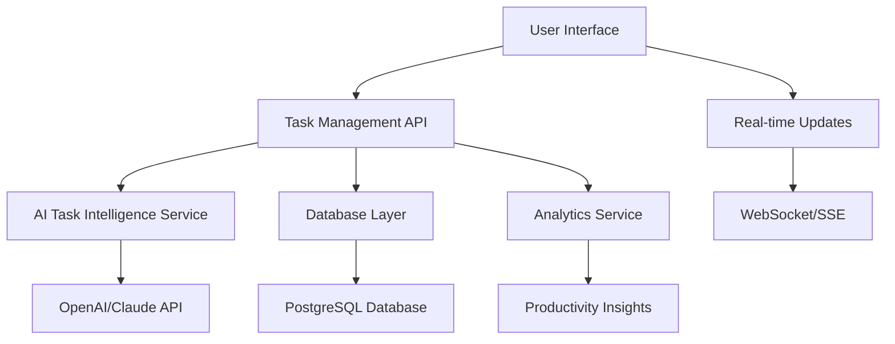

# Enhanced To-Do List Design Document

## Overview

The Enhanced To-Do List feature will extend the existing task management system in SoloSuccess AI with advanced AI-powered capabilities, smart organization, and comprehensive analytics. The design leverages the existing database schema while adding new tables and enhancing the current task management workflow.

## Architecture

### High-Level Architecture



### System Components

1. **Enhanced Task Management UI** - React components with advanced features
2. **Task Intelligence API** - AI-powered task suggestions and optimization
3. **Analytics Engine** - Productivity tracking and insights
4. **Real-time Sync** - Live updates and notifications
5. **Mobile-Optimized Interface** - Touch-friendly responsive design

## Components and Interfaces

### Database Schema Extensions

#### Enhanced Tasks Table (Extend Existing)

```sql
-- Add new columns to existing tasks table
ALTER TABLE tasks ADD COLUMN estimated_minutes INTEGER;
ALTER TABLE tasks ADD COLUMN actual_minutes INTEGER;
ALTER TABLE tasks ADD COLUMN category VARCHAR(100);
ALTER TABLE tasks ADD COLUMN tags JSONB DEFAULT '[]';
ALTER TABLE tasks ADD COLUMN ai_suggestions JSONB DEFAULT '{}';
ALTER TABLE tasks ADD COLUMN energy_level VARCHAR(20) DEFAULT 'medium';
ALTER TABLE tasks ADD COLUMN is_recurring BOOLEAN DEFAULT false;
ALTER TABLE tasks ADD COLUMN recurrence_pattern JSONB;
ALTER TABLE tasks ADD COLUMN parent_task_id INTEGER REFERENCES tasks(id);
```

#### New Task Categories Table

```sql
CREATE TABLE task_categories (
  id INTEGER PRIMARY KEY GENERATED ALWAYS AS IDENTITY,
  user_id INTEGER NOT NULL REFERENCES users(id) ON DELETE CASCADE,
  name VARCHAR(100) NOT NULL,
  color VARCHAR(7) DEFAULT '#8B5CF6',
  icon VARCHAR(50),
  is_default BOOLEAN DEFAULT false,
  created_at TIMESTAMP DEFAULT NOW(),
  updated_at TIMESTAMP DEFAULT NOW()
);
```

#### Task Analytics Table

```sql
CREATE TABLE task_analytics (
  id INTEGER PRIMARY KEY GENERATED ALWAYS AS IDENTITY,
  user_id INTEGER NOT NULL REFERENCES users(id) ON DELETE CASCADE,
  task_id INTEGER NOT NULL REFERENCES tasks(id) ON DELETE CASCADE,
  action VARCHAR(50) NOT NULL, -- 'created', 'started', 'completed', 'postponed'
  timestamp TIMESTAMP DEFAULT NOW(),
  metadata JSONB DEFAULT '{}'
);
```

#### Productivity Insights Table

```sql
CREATE TABLE productivity_insights (
  id INTEGER PRIMARY KEY GENERATED ALWAYS AS IDENTITY,
  user_id INTEGER NOT NULL REFERENCES users(id) ON DELETE CASCADE,
  insight_type VARCHAR(50) NOT NULL, -- 'daily', 'weekly', 'monthly'
  date DATE NOT NULL,
  metrics JSONB NOT NULL,
  ai_recommendations JSONB DEFAULT '{}',
  created_at TIMESTAMP DEFAULT NOW()
);
```

### API Endpoints Design

#### Enhanced Task Management API

*GET /api/tasks**

- Query parameters: `category`, `priority`, `status`, `due_date`, `search`
- Response: Paginated task list with smart sorting
- Features: Intelligent filtering and search

*POST /api/tasks**

- Enhanced task creation with AI suggestions
- Auto-categorization based on content analysis
- Smart time estimation using historical data

**PUT /api/tasks/[id]**

- Task updates with progress tracking
- AI-powered optimization suggestions
- Automatic analytics logging

**DELETE /api/tasks/[id]**

- Soft delete with analytics preservation
- Cascade handling for subtasks

#### AI Intelligence API

*POST /api/tasks/ai/suggest**

- Input: Task description, user context
- Output: Suggested improvements, categories, time estimates
- AI Model: GPT-4 or Claude for task analysis

*POST /api/tasks/ai/optimize**

- Input: User's task list and preferences
- Output: Optimized task ordering and scheduling
- Features: Energy level matching, dependency analysis

*GET /api/tasks/ai/insights**

- Productivity insights and recommendations
- Personalized tips based on completion patterns
- Weekly/monthly productivity reports

#### Analytics API

*GET /api/analytics/productivity**

- Comprehensive productivity metrics
- Time-based analytics (daily, weekly, monthly)
- Completion rates and trend analysis

*GET /api/analytics/insights**

- AI-generated productivity insights
- Personalized recommendations
- Performance benchmarking

### Frontend Components Architecture

#### Core Components

**TaskManager** - Main container component

```typescript
interface TaskManagerProps {
  initialTasks?: Task[]
  view?: 'list' | 'kanban' | 'calendar'
  filters?: TaskFilters
}
```

**TaskList** - Enhanced task display

```typescript
interface TaskListProps {
  tasks: Task[]
  onTaskUpdate: (task: Task) => void
  onTaskComplete: (taskId: string) => void
  sortBy: 'priority' | 'due_date' | 'ai_score'
  groupBy?: 'category' | 'priority' | 'project'
}
```

**TaskCard** - Individual task component

```typescript
interface TaskCardProps {
  task: Task
  onEdit: (task: Task) => void
  onComplete: () => void
  onDelete: () => void
  showAISuggestions?: boolean
}
```

**TaskCreationModal** - Enhanced task creation

```typescript
interface TaskCreationModalProps {
  isOpen: boolean
  onClose: () => void
  onSubmit: (task: CreateTaskRequest) => void
  aiSuggestions?: AISuggestions
  defaultCategory?: string
}
```

**ProductivityDashboard** - Analytics display

```typescript
interface ProductivityDashboardProps {
  userId: string
  timeRange: 'week' | 'month' | 'quarter'
  metrics: ProductivityMetrics
}
```

#### Mobile-Optimized Components

**MobileTaskList** - Touch-optimized task list

- Swipe gestures for quick actions
- Pull-to-refresh functionality
- Infinite scroll for large task lists

**QuickTaskEntry** - Fast task creation

- Voice input support
- Smart autocomplete
- One-tap category selection

## Data Models

### Enhanced Task Model

```typescript
interface Task {
  id: string
  user_id: string
  goal_id?: string
  briefcase_id?: string
  parent_task_id?: string
  title: string
  description?: string
  status: 'pending' | 'in_progress' | 'completed' | 'cancelled'
  priority: 'low' | 'medium' | 'high' | 'urgent'
  category: string
  tags: string[]
  due_date?: Date
  estimated_minutes?: number
  actual_minutes?: number
  energy_level: 'low' | 'medium' | 'high'
  is_recurring: boolean
  recurrence_pattern?: RecurrencePattern
  ai_suggestions: AISuggestions
  completed_at?: Date
  created_at: Date
  updated_at: Date
}
```

### AI Suggestions Model

```typescript
interface AISuggestions {
  suggested_category?: string
  estimated_time?: number
  priority_recommendation?: string
  breakdown_suggestions?: string[]
  optimal_time_slots?: TimeSlot[]
  related_tasks?: string[]
}
```

### Productivity Metrics Model

```typescript
interface ProductivityMetrics {
  tasks_completed: number
  tasks_created: number
  completion_rate: number
  average_completion_time: number
  productivity_score: number
  streak_days: number
  peak_productivity_hours: number[]
  category_breakdown: CategoryMetrics[]
}
```

## Error Handling

### API Error Responses

- **400 Bad Request** - Invalid task data or parameters
- **401 Unauthorized** - Authentication required
- **403 Forbidden** - Insufficient permissions
- **404 Not Found** - Task or resource not found
- **429 Too Many Requests** - Rate limit exceeded
- **500 Internal Server Error** - Server-side errors

### Frontend Error Handling

- Graceful degradation when AI services are unavailable
- Offline task creation with sync when online
- User-friendly error messages with recovery suggestions
- Automatic retry mechanisms for failed operations

## Testing Strategy

### Unit Tests

- Task CRUD operations
- AI suggestion algorithms
- Analytics calculations
- Component rendering and interactions

### Integration Tests

- API endpoint functionality
- Database operations
- AI service integration
- Authentication flows

### End-to-End Tests

- Complete task management workflows
- Mobile responsiveness
- Cross-browser compatibility
- Performance under load

### AI Testing

- Task suggestion accuracy
- Category prediction validation
- Time estimation precision
- Productivity insight relevance

## Performance Considerations

### Database Optimization

- Indexed queries for task filtering and sorting
- Efficient pagination for large task lists
- Optimized analytics queries with aggregations
- Connection pooling for high concurrency

### Frontend Performance

- Virtual scrolling for large task lists
- Lazy loading of task details
- Optimistic updates for better UX
- Efficient state management with React Query

### AI Service Optimization

- Caching of AI suggestions
- Batch processing for multiple tasks
- Fallback mechanisms when AI is unavailable
- Rate limiting to manage API costs

## Security Considerations

### Data Protection

- User task data isolation
- Encrypted sensitive information
- Secure API authentication
- GDPR compliance for analytics data

### AI Privacy

- No sensitive data sent to AI services
- User consent for AI features
- Data anonymization for insights
- Opt-out mechanisms for AI suggestions

## Accessibility Features

### WCAG 2.1 Compliance

- Keyboard navigation for all features
- Screen reader compatibility
- High contrast mode support
- Focus management for modals

### Inclusive Design

- Voice input for task creation
- Customizable text sizes
- Color-blind friendly indicators
- Simplified interface options
