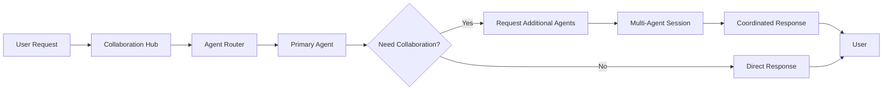

# 🤖 Task 4: Multi-Agent Collaboration System - Architecture & Design

## 📋 **Overview**

**Goal**: Build an advanced multi-agent collaboration system where AI agents can communicate, coordinate, and work together on complex projects.

**Timeline**: Week 5-8 (4 weeks)  
**Priority**: Very High - Unique value proposition  
**Status**: Planning Phase  

## 🎯 **Core Vision**

Transform SoloSuccess AI from individual agent interactions to a collaborative AI ecosystem where agents:
- Communicate with each other seamlessly
- Share context and knowledge across conversations  
- Coordinate on multi-step projects
- Provide unified project delivery
- Learn from cross-functional collaboration

## 🏗️ **System Architecture**

### **1. Agent Communication Protocol**

```typescript
interface AgentMessage {
  id: string
  fromAgent: string
  toAgent: string | 'broadcast'
  messageType: 'request' | 'response' | 'notification' | 'handoff'
  content: string
  context: AgentContext
  priority: 'low' | 'medium' | 'high' | 'urgent'
  timestamp: Date
  threadId?: string
  parentMessageId?: string
}

interface AgentContext {
  userId: string
  projectId?: string
  taskIds: string[]
  previousMessages: string[]
  sharedData: Record<string, any>
  capabilities: string[]
  specializations: string[]
}
```

### **2. Collaboration Hub Architecture**

```
┌─────────────────────────────────────────┐
│           Collaboration Hub             │
├─────────────────────────────────────────┤
│  • Message Router                       │
│  • Context Manager                      │
│  • Agent Registry                       │
│  • Project Coordinator                  │
│  • Decision Engine                      │
└─────────────────────────────────────────┘
              │
    ┌─────────┼─────────┐
    │         │         │
┌───▼───┐ ┌───▼───┐ ┌───▼───┐
│ Roxy  │ │ Blaze │ │ Echo  │
│ Exec  │ │ Growth│ │ Market│
└───────┘ └───────┘ └───────┘
    │         │         │
┌───▼───┐ ┌───▼───┐ ┌───▼───┐
│ Lumi  │ │ Vex   │ │ Lexi  │
│ Legal │ │ Tech  │ │ Data  │
└───────┘ └───────┘ └───────┘
```

### **3. Data Flow Model**



## 🚀 **Key Features**

### **1. Agent-to-Agent Communication**
- **Message Routing System**: Central hub for agent communications
- **Context Preservation**: Shared understanding across agent interactions
- **Asynchronous Messaging**: Non-blocking agent communications
- **Priority Handling**: Urgent requests get immediate attention

### **2. Collaborative Project Planning**
- **Project Decomposition**: Break complex projects into agent-specific tasks
- **Resource Allocation**: Assign agents based on expertise and availability
- **Timeline Coordination**: Ensure dependent tasks are properly sequenced
- **Progress Synchronization**: Real-time updates on project status

### **3. Unified Project Delivery**
- **Deliverable Aggregation**: Combine outputs from multiple agents
- **Quality Assurance**: Cross-agent review and validation
- **Consistent Formatting**: Unified presentation of collaborative work
- **Version Control**: Track contributions from each agent

### **4. Cross-Functional Strategy Coordination**
- **Strategy Alignment**: Ensure all agents work toward common goals
- **Decision Consensus**: Collaborative decision-making processes
- **Conflict Resolution**: Handle disagreements between agent recommendations
- **Knowledge Sharing**: Agents learn from each other's expertise

## 🛠️ **Technical Implementation**

### **Core Components**

#### **1. Collaboration Hub (`lib/collaboration-hub.ts`)**
```typescript
export class CollaborationHub {
  private agents: Map<string, Agent>
  private activeProjects: Map<string, CollaborationProject>
  private messageRouter: MessageRouter
  private contextManager: ContextManager
  
  async initiateCollaboration(request: CollaborationRequest): Promise<CollaborationSession>
  async routeMessage(message: AgentMessage): Promise<void>
  async coordinateProject(project: CollaborationProject): Promise<ProjectPlan>
  async handleAgentHandoff(fromAgent: string, toAgent: string, context: AgentContext): Promise<void>
}
```

#### **2. Message Router (`lib/message-router.ts`)**
```typescript
export class MessageRouter {
  async routeMessage(message: AgentMessage): Promise<AgentMessage[]>
  async broadcastMessage(message: AgentMessage, excludeAgent?: string): Promise<void>
  async findBestAgent(request: AgentRequest, excludeAgents?: string[]): Promise<string>
  async establishCommunicationChannel(agents: string[]): Promise<string>
}
```

#### **3. Context Manager (`lib/context-manager.ts`)**
```typescript
export class ContextManager {
  async shareContext(fromAgent: string, toAgent: string, context: AgentContext): Promise<void>
  async updateSharedContext(projectId: string, updates: Partial<AgentContext>): Promise<void>
  async getProjectContext(projectId: string): Promise<AgentContext>
  async mergeDuplicateContexts(contexts: AgentContext[]): Promise<AgentContext>
}
```

#### **4. Project Coordinator (`lib/project-coordinator.ts`)**
```typescript
export class ProjectCoordinator {
  async createProjectPlan(request: CollaborationRequest): Promise<ProjectPlan>
  async assignTaskToAgent(task: ProjectTask, agentId: string): Promise<void>
  async trackProjectProgress(projectId: string): Promise<ProjectStatus>
  async handleTaskDependencies(projectId: string): Promise<TaskDependency[]>
}
```

### **Database Schema**

```sql
-- Agent collaboration sessions
CREATE TABLE collaboration_sessions (
  id UUID PRIMARY KEY DEFAULT gen_random_uuid(),
  user_id INTEGER NOT NULL,
  project_name VARCHAR(255),
  participating_agents JSONB NOT NULL,
  session_status VARCHAR(50) DEFAULT 'active',
  created_at TIMESTAMP WITH TIME ZONE DEFAULT NOW(),
  updated_at TIMESTAMP WITH TIME ZONE DEFAULT NOW(),
  completed_at TIMESTAMP WITH TIME ZONE
);

-- Agent messages in collaboration
CREATE TABLE agent_messages (
  id UUID PRIMARY KEY DEFAULT gen_random_uuid(),
  session_id UUID REFERENCES collaboration_sessions(id),
  from_agent VARCHAR(100) NOT NULL,
  to_agent VARCHAR(100), -- NULL for broadcasts
  message_type VARCHAR(50) NOT NULL,
  content TEXT NOT NULL,
  context JSONB,
  priority VARCHAR(20) DEFAULT 'medium',
  thread_id UUID,
  parent_message_id UUID REFERENCES agent_messages(id),
  created_at TIMESTAMP WITH TIME ZONE DEFAULT NOW()
);

-- Project plans and tasks
CREATE TABLE collaboration_projects (
  id UUID PRIMARY KEY DEFAULT gen_random_uuid(),
  session_id UUID REFERENCES collaboration_sessions(id),
  project_name VARCHAR(255) NOT NULL,
  description TEXT,
  assigned_agents JSONB NOT NULL,
  project_plan JSONB,
  status VARCHAR(50) DEFAULT 'planning',
  deliverables JSONB,
  created_at TIMESTAMP WITH TIME ZONE DEFAULT NOW(),
  updated_at TIMESTAMP WITH TIME ZONE DEFAULT NOW()
);

-- Shared context between agents
CREATE TABLE agent_shared_context (
  id UUID PRIMARY KEY DEFAULT gen_random_uuid(),
  session_id UUID REFERENCES collaboration_sessions(id),
  context_key VARCHAR(255) NOT NULL,
  context_data JSONB NOT NULL,
  created_by_agent VARCHAR(100) NOT NULL,
  accessible_to_agents JSONB NOT NULL,
  created_at TIMESTAMP WITH TIME ZONE DEFAULT NOW(),
  updated_at TIMESTAMP WITH TIME ZONE DEFAULT NOW()
);

-- Agent handoff records
CREATE TABLE agent_handoffs (
  id UUID PRIMARY KEY DEFAULT gen_random_uuid(),
  session_id UUID REFERENCES collaboration_sessions(id),
  from_agent VARCHAR(100) NOT NULL,
  to_agent VARCHAR(100) NOT NULL,
  handoff_reason VARCHAR(255),
  context_transferred JSONB,
  handoff_status VARCHAR(50) DEFAULT 'completed',
  created_at TIMESTAMP WITH TIME ZONE DEFAULT NOW()
);
```

## 🎨 **User Interface Design**

### **1. Collaboration Dashboard**
- **Active Sessions**: View all ongoing collaborative sessions
- **Agent Status**: See which agents are available/busy
- **Project Timeline**: Visual representation of project progress
- **Communication Feed**: Real-time agent-to-agent messages

### **2. Multi-Agent Chat Interface**
```typescript
interface MultiAgentChatProps {
  sessionId: string
  participatingAgents: Agent[]
  onAgentJoin: (agentId: string) => void
  onAgentLeave: (agentId: string) => void
  onProjectCreate: (project: CollaborationProject) => void
}
```

### **3. Project Collaboration View**
- **Agent Assignments**: Visual task allocation
- **Progress Tracking**: Real-time project status
- **Deliverable Preview**: Combined outputs from all agents
- **Communication History**: Agent conversation logs

## 🔄 **Collaboration Workflows**

### **Workflow 1: Complex Project Planning**
1. User submits complex request (e.g., "Launch a new product")
2. Roxy (Executive) analyzes and creates project breakdown
3. Roxy requests Blaze (Growth) for market strategy
4. Roxy requests Echo (Marketing) for campaign planning
5. Roxy requests Lumi (Legal) for compliance review
6. Agents collaborate, share insights, refine plan
7. Unified deliverable presented to user

### **Workflow 2: Cross-Functional Decision Making**
1. User asks for strategic decision (e.g., "Should we expand to new market?")
2. Multiple agents provide specialized input
3. Agents debate pros/cons in shared context
4. Consensus-building through structured discussion
5. Final recommendation with supporting evidence

### **Workflow 3: Agent Handoff & Specialization**
1. User starts with general inquiry
2. Primary agent identifies need for specialist
3. Smooth handoff with complete context transfer
4. Specialist agent takes over with full understanding
5. Option to bring original agent back for final review

## 📊 **Success Metrics**

### **Performance Metrics**
- **Collaboration Frequency**: Number of multi-agent sessions per day
- **Project Completion Rate**: Percentage of collaborative projects completed
- **Response Time**: Average time for agent-to-agent communication
- **Context Accuracy**: How well context is preserved across handoffs

### **Quality Metrics**
- **User Satisfaction**: Rating of collaborative vs. single-agent responses
- **Output Coherence**: Consistency of multi-agent deliverables
- **Agent Specialization**: How often agents stay within expertise areas
- **Conflict Resolution**: Success rate of handling agent disagreements

### **Business Metrics**
- **Feature Adoption**: Usage of collaboration features
- **Session Duration**: Length of multi-agent interactions
- **Project Complexity**: Average number of agents per project
- **User Retention**: Impact on overall platform engagement

## 🚧 **Implementation Phases**

### **Phase 1: Foundation (Week 5)**
- [ ] Build Collaboration Hub core architecture
- [ ] Implement basic agent-to-agent messaging
- [ ] Create database schema and API endpoints
- [ ] Basic multi-agent chat interface

### **Phase 2: Project Coordination (Week 6)**
- [ ] Build Project Coordinator
- [ ] Implement task assignment and tracking
- [ ] Create project collaboration UI
- [ ] Add context sharing mechanisms

### **Phase 3: Advanced Features (Week 7)**
- [ ] Agent handoff protocols
- [ ] Conflict resolution systems
- [ ] Advanced project planning algorithms
- [ ] Performance analytics and monitoring

### **Phase 4: Polish & Optimization (Week 8)**
- [ ] UI/UX refinements
- [ ] Performance optimizations
- [ ] Testing and bug fixes
- [ ] Documentation and user guides

## 🎯 **Next Steps**

1. **Create core collaboration infrastructure**
2. **Implement agent registry and discovery**
3. **Build message routing system**
4. **Design multi-agent chat interface**
5. **Test with simple collaboration scenarios**
6. **Iterate based on user feedback**

## 💡 **Innovation Opportunities**

### **AI-Powered Enhancements**
- **Intelligent Agent Selection**: ML model to choose optimal agent combinations
- **Context Prediction**: Anticipate what context agents will need
- **Collaboration Patterns**: Learn from successful agent interactions
- **Automated Handoffs**: Smart routing based on conversation flow

### **Advanced Collaboration Features**
- **Agent Personalities**: Different collaboration styles per agent
- **Expertise Learning**: Agents learn from each other's strengths  
- **Dynamic Team Formation**: Agents self-organize for optimal results
- **Collaborative Memory**: Shared knowledge base across all agents

---

This architecture provides a robust foundation for the multi-agent collaboration system while maintaining flexibility for future enhancements and optimizations.