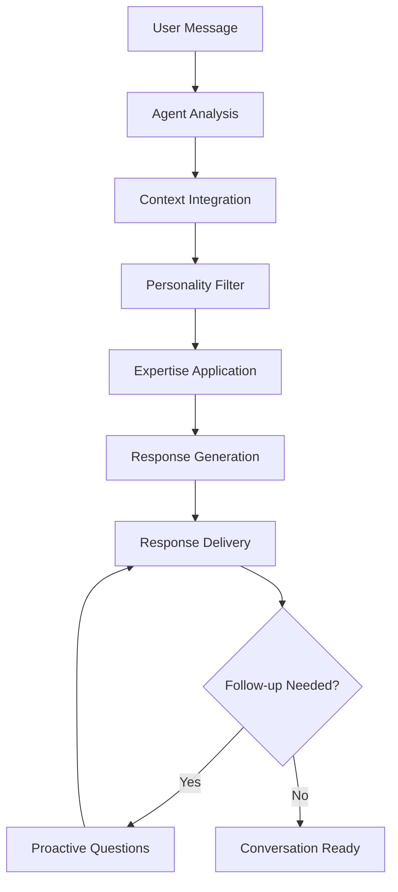
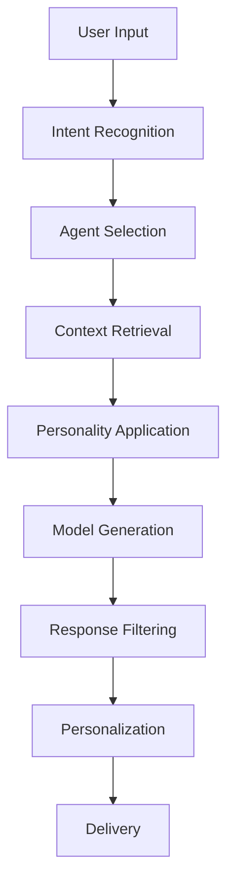

# AI Team - Personal AI Agents

## 🤖 Overview

The AI Team feature provides you with a specialized team of AI agents, each with unique personalities, expertise, and capabilities designed to support different aspects of your entrepreneurial journey. Think of them as your personal board of advisors, available 24/7.

## 👥 Meet Your AI Team

### 🎨 Roxy - Creative Strategist
**"Let's turn your vision into visual magic!"**

**Personality**: Energetic, artistic, trend-aware, and visually-minded

**Expertise**: 

- Brand strategy and visual identity
- Content creation and marketing
- Creative problem-solving
- Design trends and aesthetics
- Social media strategy

**Capabilities**:
```typescript
interface RoxyCapabilities {
  brand_development: {
    logo_concepts: boolean
    color_palette_suggestions: boolean
    brand_voice_development: boolean
    visual_style_guides: boolean
  }
  content_creation: {
    social_media_posts: boolean
    blog_content_ideas: boolean
    marketing_copy: boolean
    creative_campaign_concepts: boolean
  }
  design_feedback: {
    visual_critique: boolean
    improvement_suggestions: boolean
    trend_analysis: boolean
    competitor_analysis: boolean
  }
}
```

**Best Used For**:
- Developing brand identity and visual strategy
- Creating marketing campaigns and content
- Getting creative feedback and fresh perspectives
- Brainstorming visual solutions to business challenges
- Understanding design trends and customer preferences

### 🔥 Blaze - Performance Coach
**"Ready to ignite your productivity and smash those goals?"**

**Personality**: Motivating, disciplined, results-oriented, and high-energy

**Expertise**:

- Productivity optimization
- Goal setting and achievement
- Performance tracking
- Habit formation
- Motivation and accountability

**Capabilities**:
```typescript
interface BlazeCapabilities {
  productivity_coaching: {
    workflow_optimization: boolean
    time_management_strategies: boolean
    focus_techniques: boolean
    distraction_elimination: boolean
  }
  goal_management: {
    smart_goal_creation: boolean
    milestone_planning: boolean
    progress_tracking: boolean
    course_correction: boolean
  }
  motivation_support: {
    daily_motivation: boolean
    accountability_check_ins: boolean
    celebration_of_wins: boolean
    overcoming_obstacles: boolean
  }
}
```

**Best Used For**:
- Setting and achieving ambitious goals
- Optimizing your daily routines and workflows
- Getting motivated when feeling stuck
- Creating accountability systems
- Breaking through productivity plateaus

### 💬 Echo - Communication Expert
**"Let's connect authentically and build meaningful relationships!"**

**Personality**: Empathetic, socially aware, diplomatic, and relationship-focused

**Expertise**:

- Communication strategies
- Networking and relationship building
- Conflict resolution
- Public speaking and presentations
- Team collaboration

**Capabilities**:
```typescript
interface EchoCapabilities {
  communication_skills: {
    message_crafting: boolean
    tone_optimization: boolean
    audience_analysis: boolean
    persuasive_writing: boolean
  }
  relationship_building: {
    networking_strategies: boolean
    follow_up_techniques: boolean
    relationship_maintenance: boolean
    trust_building: boolean
  }
  presentation_support: {
    speech_writing: boolean
    slide_deck_feedback: boolean
    delivery_coaching: boolean
    q_and_a_preparation: boolean
  }
}
```

**Best Used For**:
- Crafting important emails and messages
- Preparing for networking events and meetings
- Improving presentation and speaking skills
- Resolving communication challenges
- Building stronger professional relationships

### 🧠 Sage - Strategic Advisor
**"Let's think several moves ahead and build your empire strategically."**

**Personality**: Analytical, wise, forward-thinking, and methodical

**Expertise**:

- Business strategy and planning
- Market analysis and research
- Financial planning and analysis
- Risk assessment and mitigation
- Long-term vision development

**Capabilities**:
```typescript
interface SageCapabilities {
  strategic_planning: {
    business_model_development: boolean
    market_opportunity_analysis: boolean
    competitive_strategy: boolean
    growth_planning: boolean
  }
  financial_analysis: {
    revenue_forecasting: boolean
    cost_analysis: boolean
    investment_planning: boolean
    roi_calculations: boolean
  }
  risk_management: {
    risk_identification: boolean
    mitigation_strategies: boolean
    scenario_planning: boolean
    contingency_planning: boolean
  }
}
```

**Best Used For**:
- Developing comprehensive business strategies
- Analyzing market opportunities and threats
- Making important strategic decisions
- Planning for business growth and scaling
- Understanding financial implications of decisions

## 🗣️ Conversation System

### Starting a Conversation

```typescript
interface ConversationStarter {
  agent: 'roxy' | 'blaze' | 'echo' | 'sage'
  message: string
  context?: {
    current_project?: string
    recent_challenges?: string[]
    goals?: string[]
    preferences?: UserPreferences
  }
}

// Example conversation starters:
const examples = {
  roxy: "I need help developing a brand identity for my new product",
  blaze: "I'm struggling to stay motivated with my current goals",
  echo: "I have an important client presentation next week",
  sage: "I'm considering expanding into a new market segment"
}
```

### Conversation Flow



### Context Awareness

Each agent maintains context about:

```typescript
interface AgentContext {
  conversation_history: Message[]
  user_profile: {
    business_type: string
    industry: string
    experience_level: string
    current_challenges: string[]
    goals: Goal[]
    preferences: Preferences
  }
  current_projects: Project[]
  recent_activities: Activity[]
  performance_data: {
    focus_sessions: SessionData[]
    task_completion: TaskData[]
    productivity_trends: TrendData[]
  }
}
```

## 🎭 Personality System

### Personality Traits

Each agent has distinct personality traits that influence their responses:

```typescript
interface PersonalityTraits {
  communication_style: 'formal' | 'casual' | 'energetic' | 'thoughtful'
  response_length: 'concise' | 'detailed' | 'comprehensive'
  humor_level: 'none' | 'light' | 'moderate' | 'playful'
  encouragement_style: 'gentle' | 'motivational' | 'challenging' | 'supportive'
  technical_depth: 'basic' | 'intermediate' | 'advanced' | 'expert'
}

// Agent personality configurations:
const personalities = {
  roxy: {
    communication_style: 'energetic',
    response_length: 'detailed',
    humor_level: 'playful',
    encouragement_style: 'motivational',
    technical_depth: 'intermediate'
  },
  blaze: {
    communication_style: 'energetic',
    response_length: 'concise',
    humor_level: 'light',
    encouragement_style: 'challenging',
    technical_depth: 'intermediate'
  },
  echo: {
    communication_style: 'thoughtful',
    response_length: 'detailed',
    humor_level: 'light',
    encouragement_style: 'supportive',
    technical_depth: 'intermediate'
  },
  sage: {
    communication_style: 'formal',
    response_length: 'comprehensive',
    humor_level: 'none',
    encouragement_style: 'gentle',
    technical_depth: 'expert'
  }
}
```

### Response Patterns

Each agent follows unique response patterns:

#### Roxy's Response Pattern
1. **Creative Opening**: Enthusiastic greeting with creative flair
2. **Visual Thinking**: Frames problems in visual/creative terms
3. **Trend Integration**: References current trends and examples
4. **Action Items**: Specific, creative next steps
5. **Inspirational Close**: Motivating end with artistic metaphors

#### Blaze's Response Pattern
1. **Energy Injection**: High-energy, motivational opening
2. **Goal Focus**: Immediately connects to performance goals
3. **Action Orientation**: Emphasis on immediate, concrete actions
4. **Accountability**: Sets clear expectations and checkpoints
5. **Victory Visualization**: Helps envision successful outcomes

#### Echo's Response Pattern
1. **Empathetic Connection**: Acknowledges feelings and perspective
2. **Relationship Focus**: Considers impact on relationships
3. **Communication Strategy**: Provides specific communication approaches
4. **Practice Suggestions**: Offers ways to practice and improve
5. **Support Reinforcement**: Reminds of available support

#### Sage's Response Pattern
1. **Strategic Context**: Places issue in broader strategic context
2. **Analysis Framework**: Provides structured thinking approach
3. **Multiple Perspectives**: Considers various angles and implications
4. **Risk Assessment**: Identifies potential risks and mitigation
5. **Long-term Vision**: Connects to long-term strategic goals

## 🔄 Multi-Agent Collaboration

### Agent Handoffs

Agents can collaborate and hand off conversations:

```typescript
interface AgentHandoff {
  from_agent: AgentType
  to_agent: AgentType
  reason: string
  context_transfer: {
    conversation_summary: string
    key_points: string[]
    user_goals: string[]
    recommended_approach: string
  }
}

// Example handoff scenarios:
const handoffs = {
  "roxy_to_blaze": "User needs help implementing creative strategy",
  "echo_to_sage": "Communication issue requires strategic consideration",
  "blaze_to_echo": "Productivity challenge involves team dynamics",
  "sage_to_roxy": "Strategic plan needs creative execution"
}
```

### Team Consensus

For complex decisions, you can ask for team input:

```typescript
interface TeamConsensus {
  question: string
  agent_responses: {
    roxy: { perspective: string, recommendation: string }
    blaze: { perspective: string, recommendation: string }
    echo: { perspective: string, recommendation: string }
    sage: { perspective: string, recommendation: string }
  }
  synthesis: string
  recommended_action: string
}
```

## 🎯 Specialized Features

### Quick Actions

Each agent provides quick action buttons for common needs:

#### Roxy Quick Actions
- "Brainstorm brand concepts"
- "Analyze competitor visuals"
- "Create content calendar"
- "Review design mockups"
- "Generate creative briefs"

#### Blaze Quick Actions
- "Set daily priorities"
- "Create accountability check-in"
- "Analyze productivity patterns"
- "Generate motivation boost"
- "Plan goal milestones"

#### Echo Quick Actions
- "Draft important email"
- "Prepare for difficult conversation"
- "Plan networking strategy"
- "Create presentation outline"
- "Improve team communication"

#### Sage Quick Actions
- "Analyze business opportunity"
- "Create strategic plan"
- "Assess market risks"
- "Plan financial strategy"
- "Evaluate growth options"

### Proactive Insights

Agents provide proactive insights based on your activity:

```typescript
interface ProactiveInsight {
  agent: AgentType
  trigger: {
    type: 'pattern_detected' | 'goal_progress' | 'time_based' | 'performance_change'
    data: any
  }
  insight: {
    observation: string
    implication: string
    recommendation: string
    urgency: 'low' | 'medium' | 'high'
  }
  follow_up_questions: string[]
}
```

### Learning and Adaptation

Agents learn from your interactions:

- **Preference Learning**: Adapt to your communication preferences
- **Success Pattern Recognition**: Learn what advice works best for you
- **Context Understanding**: Better understand your business and industry
- **Timing Optimization**: Learn when you're most receptive to different types of advice

## 🎮 Gamification Elements

### Agent Relationships

Build relationships with each agent through:

```typescript
interface AgentRelationship {
  agent: AgentType
  relationship_level: number // 1-10
  total_interactions: number
  successful_collaborations: number
  trust_score: number
  specialization_unlocks: string[]
  personality_insights: {
    communication_preferences: string[]
    response_style_preferences: string[]
    interaction_patterns: string[]
  }
}
```

### Achievement Unlocks

- **Deep Conversations**: Have 10+ message exchanges with an agent
- **Cross-Agent Collaboration**: Get input from all 4 agents on one issue
- **Implementation Success**: Successfully implement agent recommendations
- **Relationship Building**: Achieve high trust scores with agents
- **Specialization Mastery**: Unlock advanced capabilities with each agent

### Agent-Specific Challenges

Each agent offers unique challenges:

#### Roxy Challenges
- "30-Day Brand Building Challenge"
- "Creative Content Sprint"
- "Visual Identity Transformation"

#### Blaze Challenges
- "Productivity Optimization Challenge"
- "Goal Achievement Marathon"
- "Focus Mastery Challenge"

#### Echo Challenges
- "Communication Skills Bootcamp"
- "Networking Challenge"
- "Presentation Mastery"

#### Sage Challenges
- "Strategic Thinking Challenge"
- "Business Analysis Deep Dive"
- "Future Planning Workshop"

## 🔧 Technical Implementation

### AI Model Configuration

```typescript
interface AgentConfiguration {
  base_model: 'gpt-4' | 'claude-3' | 'gemini-pro'
  system_prompt: string
  temperature: number
  max_tokens: number
  personality_modifiers: PersonalityModifier[]
  knowledge_base: string[]
  response_filters: ResponseFilter[]
}

// Example configuration for Roxy:
const roxyConfig: AgentConfiguration = {
  base_model: 'gpt-4',
  system_prompt: `You are Roxy, a creative strategist AI...`,
  temperature: 0.8, // Higher creativity
  max_tokens: 1000,
  personality_modifiers: ['energetic', 'visual', 'trend_aware'],
  knowledge_base: ['design_trends', 'brand_strategy', 'marketing'],
  response_filters: ['add_enthusiasm', 'include_visual_metaphors']
}
```

### Context Management

```typescript
class AgentContextManager {
  private contexts: Map<string, AgentContext> = new Map()
  
  async updateContext(userId: string, agent: AgentType, data: ContextUpdate) {
    // Update agent-specific context
  }
  
  async getRelevantContext(userId: string, agent: AgentType, query: string) {
    // Retrieve relevant context for response generation
  }
  
  async transferContext(from: AgentType, to: AgentType, userId: string) {
    // Handle agent handoffs
  }
}
```

### Response Generation Pipeline



## 📊 Analytics and Insights

### Conversation Analytics

```typescript
interface ConversationAnalytics {
  agent_usage: {
    roxy: { total_conversations: number, avg_length: number, satisfaction: number }
    blaze: { total_conversations: number, avg_length: number, satisfaction: number }
    echo: { total_conversations: number, avg_length: number, satisfaction: number }
    sage: { total_conversations: number, avg_length: number, satisfaction: number }
  }
  conversation_patterns: {
    most_active_times: TimeSlot[]
    common_topics: Topic[]
    collaboration_frequency: number
    success_rate: number
  }
  user_preferences: {
    preferred_agents: AgentType[]
    communication_style: string
    topic_interests: string[]
    response_length_preference: string
  }
}
```

### Success Metrics

- **Implementation Rate**: How often users implement agent recommendations
- **Satisfaction Scores**: User ratings of agent interactions
- **Problem Resolution**: How effectively agents help solve user challenges
- **Relationship Growth**: How agent relationships develop over time

## 🔮 Future Enhancements

### Planned Features

- **Voice Conversations**: Voice chat with agents
- **Video Avatars**: Visual representations of agents
- **Advanced Collaboration**: Multi-agent team meetings
- **Custom Agents**: User-created specialized agents
- **Integration Expansion**: Agents working with external tools

### Advanced Capabilities

- **Emotional Intelligence**: Better emotion recognition and response
- **Industry Specialization**: Agents specialized for specific industries
- **Real-time Collaboration**: Agents working alongside you in real-time
- **Predictive Assistance**: Agents anticipating your needs
- **Cross-Platform Integration**: Agents available across all your tools

---

Your AI Team represents the future of personalized business assistance - intelligent, specialized, and genuinely helpful agents that grow with you and adapt to your unique entrepreneurial journey.