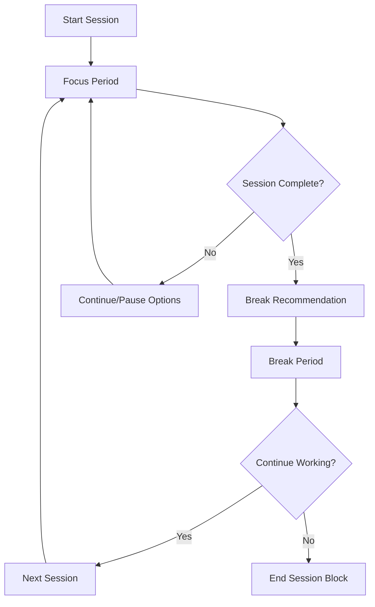

# Focus Sessions - AI-Powered Pomodoro System

## 🎯 Overview

The Focus Sessions feature is SoloSuccess AI Platform's flagship productivity tool - an intelligent Pomodoro timer system enhanced with AI-powered insights, adaptive scheduling, and comprehensive analytics.

## ✨ Key Features

### 🤖 AI-Enhanced Focus Sessions
- **Smart Duration Adjustment**: AI learns your optimal focus periods
- **Intelligent Break Recommendations**: Personalized break activities based on session intensity
- **Context-Aware Sessions**: AI considers your energy, task complexity, and historical performance
- **Adaptive Scheduling**: Dynamic session planning based on your productivity patterns

### ⏱️ Flexible Timer System
- **Customizable Durations**: 15-60 minute focus sessions
- **Multiple Session Types**: Work, creative, learning, and review sessions
- **Smart Breaks**: Short breaks (5 min), long breaks (15-30 min), and micro-breaks
- **Session Chaining**: Automatic session sequences for deep work periods

### 📊 Comprehensive Analytics
- **Productivity Insights**: Real-time and historical performance tracking
- **Pattern Recognition**: Identify your most productive times and conditions
- **Goal Tracking**: Progress towards daily, weekly, and monthly focus goals
- **Burnout Prevention**: AI monitors for signs of overwork and suggests breaks

## 🚀 Getting Started

### Starting Your First Focus Session

1. **Navigate to Focus Dashboard**
   ```
   Dashboard → Focus Sessions
   ```

2. **Choose Session Type**
   - **Work Session**: General productivity tasks (25 min default)
   - **Deep Work**: Complex, high-concentration tasks (45-60 min)
   - **Creative Session**: Brainstorming and creative work (30 min)
   - **Learning Session**: Study and skill development (25-45 min)
   - **Review Session**: Planning and reflection (15-30 min)

3. **Set Your Intention**
   - Link to a specific task from your Slaylist
   - Set a clear goal for the session
   - Choose your focus environment settings

4. **Start Focus Mode**
   - Timer begins with ambient background
   - Distractions are minimized
   - AI monitoring begins

### Session Flow



## 🎮 User Interface Components

### Focus Timer Interface

```typescript
interface FocusSession {
  id: string
  type: 'work' | 'deep_work' | 'creative' | 'learning' | 'review'
  duration: number // minutes
  remaining: number // seconds
  status: 'active' | 'paused' | 'completed' | 'cancelled'
  task_id?: string
  goal: string
  started_at: Date
  environment: {
    background_sound: string
    notifications_blocked: boolean
    distraction_blocking: boolean
  }
}
```

### Timer Controls

- **Play/Pause**: Start, pause, and resume sessions
- **Skip**: Skip to break or next session
- **Extend**: Add time to current session
- **End Early**: Complete session before timer expires
- **Emergency Stop**: Immediate session termination

### Environment Settings

- **Background Sounds**: Nature, white noise, binaural beats, cafe sounds
- **Notification Blocking**: Temporarily disable all notifications
- **Distraction Blocking**: Block social media and distracting websites
- **Focus Mode**: Full-screen timer with minimal distractions

## 🤖 AI-Powered Features

### Intelligent Session Planning

The AI analyzes your patterns to optimize focus sessions:

```typescript
interface SessionRecommendation {
  optimal_duration: number
  recommended_type: SessionType
  best_time_slots: TimeSlot[]
  energy_requirements: 'low' | 'medium' | 'high'
  suggested_break_activities: BreakActivity[]
  productivity_prediction: number // 0-10 score
}
```

### Adaptive Break Recommendations

Based on session intensity and your profile:

- **Physical Breaks**: Stretching, walking, exercise
- **Mental Breaks**: Meditation, breathing exercises
- **Creative Breaks**: Doodling, music, creative activities
- **Social Breaks**: Chat with colleagues, call a friend
- **Hydration/Nutrition**: Personalized reminders

### Performance Insights

```typescript
interface ProductivityInsights {
  focus_quality_score: number // 0-10
  optimal_session_length: number
  best_working_hours: TimeRange[]
  productivity_patterns: {
    day_of_week: DayProductivity[]
    time_of_day: HourlyProductivity[]
    session_type_effectiveness: TypeEffectiveness[]
  }
  improvement_suggestions: Suggestion[]
  burnout_risk_level: 'low' | 'medium' | 'high'
}
```

## 📊 Analytics and Tracking

### Real-Time Metrics

- **Current Session Quality**: Live focus quality assessment
- **Distraction Count**: Number of interruptions or focus breaks
- **Energy Level**: Self-reported and AI-estimated energy
- **Goal Progress**: Progress towards session-specific goals

### Historical Analytics

#### Daily View
```typescript
interface DailyFocusStats {
  date: Date
  total_focus_time: number // minutes
  sessions_completed: number
  sessions_planned: number
  average_session_quality: number
  break_adherence: number // 0-1
  top_performing_hour: number
  focus_consistency: number
}
```

#### Weekly/Monthly Trends
- Focus time trends and patterns
- Session completion rates
- Productivity score evolution
- Goal achievement tracking
- Comparison with previous periods

### Focus Quality Measurement

The system measures focus quality through:

1. **Objective Metrics**:
   - Session completion rates
   - Break timing adherence
   - Task completion during sessions
   - Time to start focused state

2. **Subjective Metrics**:
   - Post-session quality ratings
   - Energy level assessments
   - Satisfaction with session outcomes

3. **AI Analysis**:
   - Pattern recognition in behavior
   - Correlation with external factors
   - Predictive quality scoring

## 🎯 Gamification Elements

### Achievements

#### Focus Streaks
- **Getting Started**: Complete 5 focus sessions
- **Building Momentum**: 7-day focus streak
- **Focus Warrior**: 30-day focus streak
- **Zen Master**: 100 perfect focus sessions

#### Session Mastery
- **Time Master**: Complete sessions of all durations
- **Deep Diver**: Complete 10 deep work sessions
- **Creative Genius**: Complete 25 creative sessions
- **Learning Machine**: Complete 50 learning sessions

#### Quality Awards
- **Perfect Focus**: Maintain 9+ quality score for a week
- **Consistency King/Queen**: 95%+ session completion rate
- **Break Balance**: Perfect break adherence for a month

### Leveling System

```typescript
interface FocusLevel {
  current_level: number
  experience_points: number
  next_level_threshold: number
  level_benefits: {
    session_customizations: string[]
    advanced_analytics: boolean
    priority_ai_recommendations: boolean
    exclusive_backgrounds: string[]
  }
}
```

### Leaderboards

- **Weekly Focus Champions**: Top focus time for the week
- **Quality Masters**: Highest average session quality
- **Streak Leaders**: Longest current focus streaks
- **Goal Achievers**: Highest goal completion rates

## 🔧 Customization Options

### Session Preferences

```typescript
interface FocusPreferences {
  default_work_duration: number
  default_break_duration: number
  long_break_frequency: number // sessions between long breaks
  session_preparation_time: number
  end_session_buffer: number
  auto_start_breaks: boolean
  auto_start_next_session: boolean
  notification_preferences: {
    session_start_reminder: boolean
    halfway_point_notification: boolean
    five_minute_warning: boolean
    break_end_reminder: boolean
  }
}
```

### Environment Customization

- **Background Themes**: Forest, ocean, space, minimal, dark mode
- **Sound Libraries**: Extensive collection of focus-enhancing audio
- **Timer Styles**: Analog, digital, progress bar, minimalist
- **Distraction Blocking**: Customizable website and app blocking

### Integration Settings

- **Calendar Integration**: Block focus time in your calendar
- **Task Integration**: Automatic task linking and progress updates
- **Team Sync**: Share focus schedules with team members
- **External Tools**: Integration with time tracking and project management tools

## 🚀 Advanced Features

### Focus Session Templates

Pre-configured session types for different work patterns:

```typescript
interface SessionTemplate {
  name: string
  description: string
  sessions: {
    type: SessionType
    duration: number
    break_after: number
  }[]
  total_duration: number
  recommended_for: string[]
}

// Example templates:
const templates = {
  "Pomodoro Classic": {
    sessions: [
      { type: 'work', duration: 25, break_after: 5 },
      { type: 'work', duration: 25, break_after: 5 },
      { type: 'work', duration: 25, break_after: 5 },
      { type: 'work', duration: 25, break_after: 15 }
    ]
  },
  "Deep Work Block": {
    sessions: [
      { type: 'deep_work', duration: 60, break_after: 10 },
      { type: 'deep_work', duration: 60, break_after: 20 }
    ]
  }
}
```

### AI Coaching

Personalized coaching based on your focus patterns:

- **Daily Focus Planning**: AI suggests optimal session schedule
- **Real-Time Adjustments**: Dynamic recommendations during sessions
- **Weekly Reflection**: Insights and improvement suggestions
- **Goal Setting**: AI-assisted goal setting based on capabilities

### Team Focus Features

- **Focus Rooms**: Virtual co-working spaces with shared timers
- **Team Challenges**: Group focus challenges and competitions
- **Collaboration Insights**: Team productivity patterns and insights
- **Meeting-Free Zones**: Coordinated deep work periods

## 🔧 Implementation Details

### Component Architecture

```typescript
// Main focus session component
export function FocusSession() {
  const { session, controls } = useFocusSession()
  const { insights } = useProductivityInsights()
  const { preferences } = useFocusPreferences()
  
  return (
    <div className="focus-session">
      <TimerDisplay session={session} />
      <SessionControls controls={controls} />
      <EnvironmentSettings />
      <InsightsPanel insights={insights} />
    </div>
  )
}

// Timer logic hook
export function useFocusSession() {
  const [session, setSession] = useState<FocusSession | null>(null)
  const [isActive, setIsActive] = useState(false)
  
  const startSession = (config: SessionConfig) => {
    // Start session logic
  }
  
  const pauseSession = () => {
    // Pause logic
  }
  
  return { session, controls: { start: startSession, pause: pauseSession } }
}
```

### State Management

Focus session state is managed through:
- **Local State**: Timer state and UI interactions
- **Database State**: Session history and preferences
- **Real-time Updates**: Live session sharing and team features

### Performance Optimization

- **Service Workers**: Background timer management
- **Local Storage**: Offline capability for basic timer functions
- **Efficient Updates**: Minimal re-renders during timer operation
- **Battery Optimization**: Reduced background activity on mobile

## 🐛 Troubleshooting

### Common Issues

#### Timer Not Starting
1. Check browser permissions for notifications
2. Verify background tab behavior settings
3. Clear browser cache and reload
4. Check for browser extensions blocking timers

#### Inaccurate Time Tracking
1. Ensure stable internet connection
2. Check system clock accuracy
3. Verify timezone settings
4. Report persistent issues with session logs

#### Performance Issues
1. Close unnecessary browser tabs
2. Disable resource-heavy browser extensions
3. Check available system memory
4. Use dedicated focus mode browser

### Debugging

Enable debug mode for detailed logging:

```typescript
// Debug mode for focus sessions
window.SoloSuccess_DEBUG = {
  focus: true,
  ai_insights: true,
  performance: true
}
```

## 🔮 Future Enhancements

### Planned Features

- **Biometric Integration**: Heart rate and stress level monitoring
- **Voice Commands**: Voice-controlled session management
- **AR/VR Support**: Immersive focus environments
- **Advanced AI**: Predictive focus quality and personalized coaching
- **Wearable Integration**: Smartwatch and fitness tracker support

### API Integrations

- **Calendar Apps**: Google Calendar, Outlook, Apple Calendar
- **Task Managers**: Todoist, Asana, Notion, Trello
- **Communication Tools**: Slack, Microsoft Teams, Discord
- **Health Apps**: Apple Health, Google Fit, Fitbit

---

The Focus Sessions feature represents the core of SoloSuccess AI Platform's productivity philosophy: intelligent, personalized, and sustainable focus management that adapts to your unique work style and helps you achieve peak productivity while maintaining well-being.